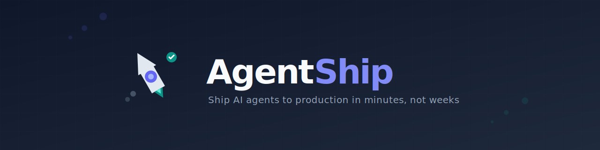

<p align="center">
  
</p>

<p align="center">
  <strong>Build and deploy AI agents in minutes, not weeks.</strong>
</p>

<p align="center">
  AgentShip is the <strong>production layer</strong> for AI agents. Built on Google ADK, it provides everything you need to ship agents to production: REST API, session management, observability, and one-command deployment.
</p>

<p align="center">
  <a href="https://www.python.org/">
    
  </a>
  <a href="https://fastapi.tiangolo.com/">
    
  </a>
  <a href="https://github.com/google/generative-ai-python">
    
  </a>
  <a href="https://openai.com/">
    
  </a>
  <a href="https://www.postgresql.org/">
    
  </a>
  <a href="https://opensource.org/licenses/MIT">
    
  </a>
</p>

---

## 🚀 Quick Start

### First Time Setup
```bash
git clone https://github.com/harshuljain13/ship-ai-agents.git
cd ship-ai-agents/ai/ai-ecosystem
make docker-setup
```

**That's it!** The script will:
- ✅ Check Docker installation
- ✅ Create `.env` file
- ✅ Prompt for your API key
- ✅ Start everything

**Access your services:**
- 🔌 **API**: http://localhost:7001/swagger
- 🔧 **Debug UI**: http://localhost:7001/debug-ui

### Next Time (After First Setup)
```bash
make docker-up      # Start containers (with hot-reload)
make docker-down    # Stop containers
make docker-logs    # View logs
```

**Hot-reload enabled!** Edit code in `src/` and changes auto-reload.

---

## 📝 Create Your First Agent

```bash
# 1. Create directory
mkdir -p src/agents/all_agents/my_agent
cd src/agents/all_agents/my_agent

# 2. Create main_agent.yaml
cat > main_agent.yaml << EOF
agent_name: my_agent
llm_provider_name: openai
llm_model: gpt-4o
temperature: 0.4
description: My helpful assistant
instruction_template: |
  You are a helpful assistant that answers questions clearly.
EOF

# 3. Create main_agent.py
cat > main_agent.py << EOF
from src.agents.all_agents.base_agent import BaseAgent
from src.models.base_models import TextInput, TextOutput
from src.agents.utils.path_utils import resolve_config_path

class MyAgent(BaseAgent):
    def __init__(self):
        super().__init__(
            config_path=resolve_config_path(relative_to=__file__),
            input_schema=TextInput,
            output_schema=TextOutput
        )
EOF
```

Restart server → Agent is automatically discovered!

---

## 🔧 Debug UI

AgentShip includes a **Gradio-based Debug UI** for testing agents interactively:

**Access**: http://localhost:7001/debug-ui (same port as API)

Features:
- 💬 Interactive chat with any registered agent
- 📝 Dynamic input forms from Pydantic schemas
- 🔍 Real-time debug logs
- 🔄 Session management (new/clear conversations)

---

## 🛠️ Commands

### Local Development (Docker) - Recommended
```bash
make docker-setup   # First-time setup (builds + starts)
make docker-up      # Start containers (after first setup)
make docker-down    # Stop containers
make docker-restart # Restart containers
make docker-logs    # View logs
```

### Local Development (No Docker)
```bash
make dev            # Start dev server → http://localhost:7001
                    # Debug UI at → http://localhost:7001/debug-ui
```

### Deploy to Heroku
```bash
make heroku-deploy  # Deploy to Heroku (one command)
```

### Other Commands
```bash
make help           # See all commands
make test           # Run tests
```

---

## 🗄️ Database Environments

AgentShip uses PostgreSQL for session storage. Different environments use different databases:

| Environment | Command | Database | Access |
|---|---|---|---|
| **Docker** | `make docker-up` | Docker PostgreSQL (`ai_agents_store`) | `postgres:5432` (inside containers) |
| **Local** | `make dev` | Local PostgreSQL (`ai_agents_session_store`) | `localhost:5432` |
| **Heroku** | Auto-provisioned | Heroku PostgreSQL | `DATABASE_URL` env var |

**Note**: Docker and local development use separate databases. Data does not sync between them.

### Docker Networking

Inside Docker, containers communicate via service names, not `localhost`:
- ✅ `postgres:5432` - Correct (Docker service name)
- ❌ `localhost:5432` - Wrong (refers to container's own network)

The `docker-compose.yml` automatically overrides the database URL for Docker networking.

---

## 📚 Documentation

- [Quick Start](docs/getting-started/quickstart.md) - Detailed guide
- [Building Agents](docs/building-agents/overview.md) - Agent patterns
- [Full Docs](docs/index.md) - Everything

---

**MIT License** | [GitHub](https://github.com/harshuljain13/ship-ai-agents)
