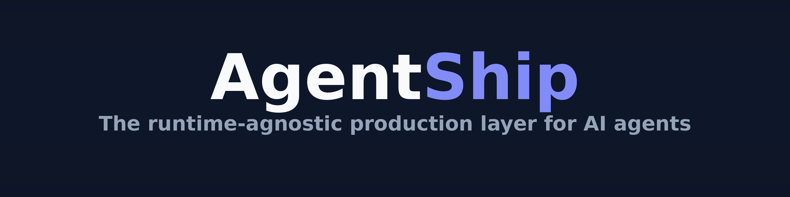
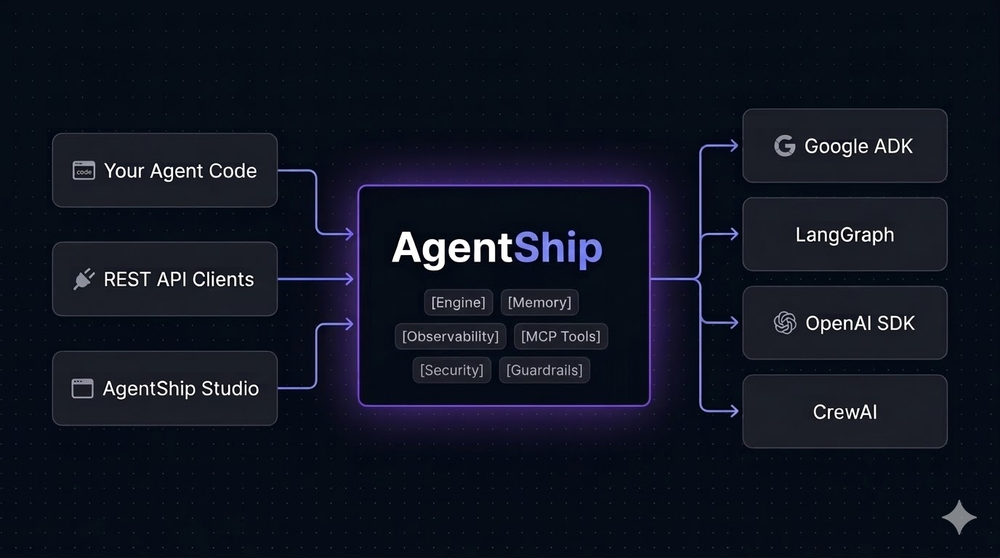

<p align="center">
  
</p>

<p align="center">
  Write your agent once. Run it on ADK, LangGraph, or any future engine.<br>
  Swap runtimes without touching agent logic. Ship in an hour, not two weeks.
</p>

<p align="center">
  <a href="https://www.python.org/"></a>
  <a href="https://fastapi.tiangolo.com/"></a>
  <a href="https://github.com/google/generative-ai-python"></a>
  <a href="https://www.langchain.com/"></a>
  <a href="https://modelcontextprotocol.io/"></a>
  <a href="https://www.postgresql.org/"></a>
  <a href="https://opensource.org/licenses/MIT"></a>
</p>

---

## The problem

Every team building AI agents hits the same two walls.

**Wall 1 – Production plumbing.** Your agent works in the notebook. Shipping it means building a REST API, wiring PostgreSQL session storage, setting up observability, writing Docker configs, handling streaming with error handling. That's ~2,000 lines of infrastructure code and two weeks of work that has nothing to do with what your agent actually does. And you rebuild it from scratch for every agent.

**Wall 2 – Framework lock-in.** You pick ADK or LangGraph on day one and build deep. Three months later you need a capability from the other one. Migration cost: 3–6 months, 50–80% of your code rewritten. Architecture decisions made at the start compound into permanent constraints.

> AgentShip is **LiteLLM for agent runtimes** – one interface to run your agents on ADK, LangGraph, or any future engine, plus the production stack (API, sessions, streaming, observability, MCP) that no engine ships with.

<p align="center">
  
</p>

---

## The solution: four pluggable layers

| Layer | Abstracts | Implementations | How to swap |
|---|---|---|---|
| **Engine** | Execution runtime | Google ADK, LangGraph + LiteLLM | `execution_engine:` in YAML |
| **Memory** | Short + long-term storage | mem0, Supermemory, in-memory | `memory_backend:` in YAML |
| **Observability** | Tracing & monitoring | Opik, LangFuse | `observability:` in YAML |
| **Tools** | Discovery & invocation | MCP – STDIO and HTTP/OAuth | `mcp.servers:` in YAML |

Your agent code never touches these directly. It talks to the abstractions. Swap any layer without a rewrite.

### Engine swap is one line

```diff
# main_agent.yaml
  agent_name: my_agent
  llm_model: gpt-4o
- execution_engine: adk
+ execution_engine: langgraph
```

Your Python class is unchanged. Your tools are unchanged. Your prompts are unchanged.

---

## Quick start

```bash
git clone https://github.com/Agent-Ship/agent-ship.git
cd agent-ship
make docker-setup   # creates .env, prompts for API key, starts everything
```

| Service | URL |
|---|---|
| API + Swagger | http://localhost:7001/swagger |
| AgentShip Studio | http://localhost:7001/studio |
| Docs | http://localhost:7001/docs |

```bash
make docker-up      # start (subsequent runs)
make docker-logs    # tail logs
make docker-down    # stop
```

---

## Build an agent

Two files. That's an agent.

**`src/all_agents/my_agent/main_agent.yaml`**
```yaml
agent_name: my_agent
llm_provider_name: openai
llm_model: gpt-4o
temperature: 0.4
execution_engine: adk        # change to langgraph – class below is unchanged
description: A helpful assistant
instruction_template: |
  You are a helpful assistant that answers questions clearly.
```

**`src/all_agents/my_agent/main_agent.py`**
```python
from src.all_agents.base_agent import BaseAgent
from src.service.models.base_models import TextInput, TextOutput
from src.agent_framework.utils.path_utils import resolve_config_path

class MyAgent(BaseAgent):
    def __init__(self):
        super().__init__(
            config_path=resolve_config_path(relative_to=__file__),
            input_schema=TextInput,
            output_schema=TextOutput,
        )
```

Restart the server – the agent is auto-discovered. No registration step.

---

## MCP tools

AgentShip has production-ready MCP integration across both engines. Declare the servers an agent should use in its YAML:

```yaml
# main_agent.yaml
mcp:
  servers:
    - postgres   # STDIO – shared client, env-var connection string
    - github     # HTTP/OAuth – per-agent isolated client
```

AgentShip connects at startup, fetches tool schemas, and automatically injects LLM-readable documentation into the agent's system prompt. Zero manual work.

<details>
<summary><strong>MCP server configuration reference</strong></summary>

**`.mcp.settings.json`** – define servers once, reference by name in any agent YAML:

```json
{
  "servers": {
    "postgres": {
      "transport": "stdio",
      "command": "npx",
      "args": ["-y", "@modelcontextprotocol/server-postgres", "${AGENT_SESSION_STORE_URI}"]
    },
    "github": {
      "transport": "http",
      "url": "https://api.githubcopilot.com/mcp/",
      "auth": {
        "type": "oauth",
        "provider": "github",
        "client_id_env": "GITHUB_OAUTH_CLIENT_ID",
        "client_secret_env": "GITHUB_OAUTH_CLIENT_SECRET",
        "authorize_url": "https://github.com/login/oauth/authorize",
        "token_url": "https://github.com/login/oauth/access_token",
        "scopes": ["repo", "read:org"]
      }
    }
  }
}
```

**Transports:**

| | Use case | Auth |
|---|---|---|
| `stdio` | Local processes (`npx`, Python scripts) | env vars |
| `http` | Remote APIs (GitHub, Slack, etc.) | OAuth 2.0 |

</details>

---

## Impact

| | Without AgentShip | With AgentShip |
|---|---|---|
| Time to production (per agent) | 2 weeks | **1 hour** |
| Infrastructure code | ~2,000 lines | **~50 lines** (agent logic only) |
| Observability setup | 2–3 days | **0** (built-in) |
| Session management | 2–3 days | **0** (built-in) |
| Engine migration | 3–6 months, 50–80% rewrite | **One line in YAML** |
| MCP tool integration | Manual per-framework | **Config declaration, auto-discovered** |

---

## Example agents

The GitHub and PostgreSQL pairs are the clearest demonstration of runtime-agnostic design – identical capability, different engine.

| Agent | Demonstrates |
|---|---|
| [`single_agent_pattern/`](src/all_agents/single_agent_pattern/) | Minimal two-file agent |
| [`orchestrator_pattern/`](src/all_agents/orchestrator_pattern/) | Sub-agents as tools |
| [`tool_pattern/`](src/all_agents/tool_pattern/) | Custom function tools |
| [`file_analysis_agent/`](src/all_agents/file_analysis_agent/) | PDF and document parsing |
| [`postgres_adk_mcp_agent/`](src/all_agents/postgres_adk_mcp_agent/) | STDIO MCP · ADK engine |
| [`postgres_langgraph_mcp_agent/`](src/all_agents/postgres_langgraph_mcp_agent/) | STDIO MCP · LangGraph engine |
| [`github_adk_mcp_agent/`](src/all_agents/github_adk_mcp_agent/) | HTTP/OAuth MCP · ADK engine |
| [`github_langgraph_mcp_agent/`](src/all_agents/github_langgraph_mcp_agent/) | HTTP/OAuth MCP · LangGraph engine – **engine swap demo** |

---

## Reference

<details>
<summary><strong>All make commands</strong></summary>

```bash
# Docker (recommended)
make docker-setup    # first-time setup
make docker-up       # start
make docker-down     # stop
make docker-restart  # restart
make docker-reload   # hard rebuild + restart
make docker-logs     # tail logs

# Local (no Docker)
make dev             # start at localhost:7001

# Quality
make test            # run all tests
make test-cov        # tests + coverage report
make lint            # flake8
make format          # black

# Deploy
make heroku-deploy   # one-command Heroku deploy
make help            # full command list
```

</details>

<details>
<summary><strong>Tests</strong></summary>

```bash
pipenv run pytest tests/unit/ -v
pipenv run pytest tests/integration/ -v
pipenv run pytest tests/integration/test_agent_naming.py -v
pipenv run pytest tests/integration/test_mcp_infrastructure.py -v
pipenv run pytest tests/integration/test_streaming.py -v
```

> Tests requiring a live database check `AGENT_SESSION_STORE_URI` and skip if unset.
> Tests requiring an LLM key check `OPENAI_API_KEY` and skip if unset.

</details>

<details>
<summary><strong>Database environments</strong></summary>

| Environment | Command | Host | Port |
|---|---|---|---|
| Docker | `make docker-up` | `postgres` (service name) | `5432` internal · `5433` external |
| Local | `make dev` | `localhost` | `5432` |
| Heroku | auto-provisioned | `DATABASE_URL` env var | - |

Docker containers communicate via service names, not `localhost`. The `docker-compose.yml` overrides `AGENT_SESSION_STORE_URI` automatically.

</details>

---

## Roadmap

**Now (v1, March 2026):** ADK · LangGraph · MCP STDIO + HTTP/OAuth · PostgreSQL sessions · Opik observability · AgentShip Studio · Auto tool documentation · Docker · Three streaming modes

**Q2–Q3 2026:** OpenAI Agents SDK engine · CrewAI engine · mem0 + Supermemory backends · LangFuse observability · Response caching · Guardrails · A2A protocol · AgentShip CLI

**Longer term:** Eval framework · pgvector memory · AgentShip Hub (community registry) · One-click Heroku/Render/Railway deploy

---

## Contributing

The most valuable contributions are new implementations of the four pluggable layers:

- **New engines** – OpenAI Agents SDK, CrewAI, Autogen adapters
- **New memory backends** – Zep, Pinecone, custom vector stores
- **New observability backends** – LangFuse, custom tracing integrations
- **New MCP transports** – additional protocol implementations

Check [`good first issue`](https://github.com/Agent-Ship/agent-ship/labels/good%20first%20issue), read [`CLAUDE.md`](CLAUDE.md) for the developer guide, then:

```bash
make test && make lint
```

All PRs require passing integration tests.

---

<p align="center">MIT License · Built by <a href="https://github.com/Agent-Ship/agent-ship">AgentShip</a> · Open source, no vendor allegiance</p>
